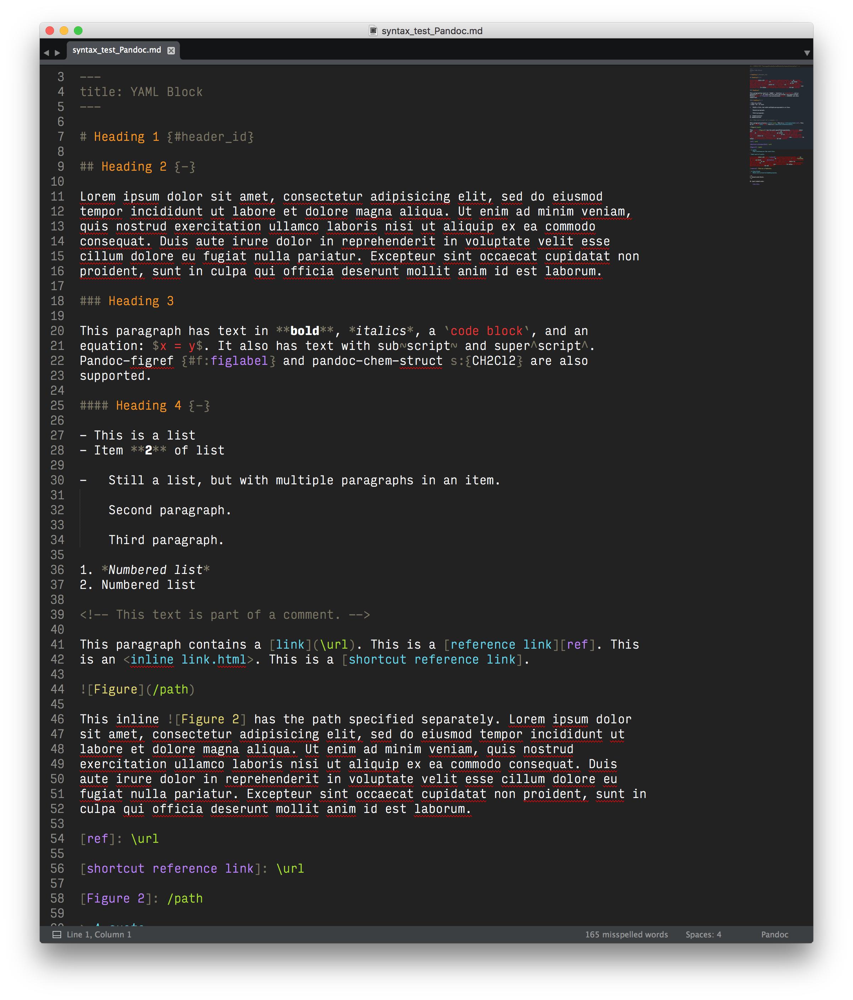

# PandocSyntax: A sublime-syntax definition for users of Pandoc

PandocSyntax is a simple syntax definition file for [Sublime Text 3][] in the
[.sublime-syntax][] format. It is designed to work with the [Monokai Extended][]
color scheme, although this should be easily modifiable.

[Sublime Text 3]: https://www.sublimetext.com/3
[.sublime-syntax]: https://www.sublimetext.com/docs/3/syntax.html
[Monokai Extended]: https://github.com/jonschlinkert/sublime-monokai-extended

## Installation

Copy to Sublime Text's packages folder.
