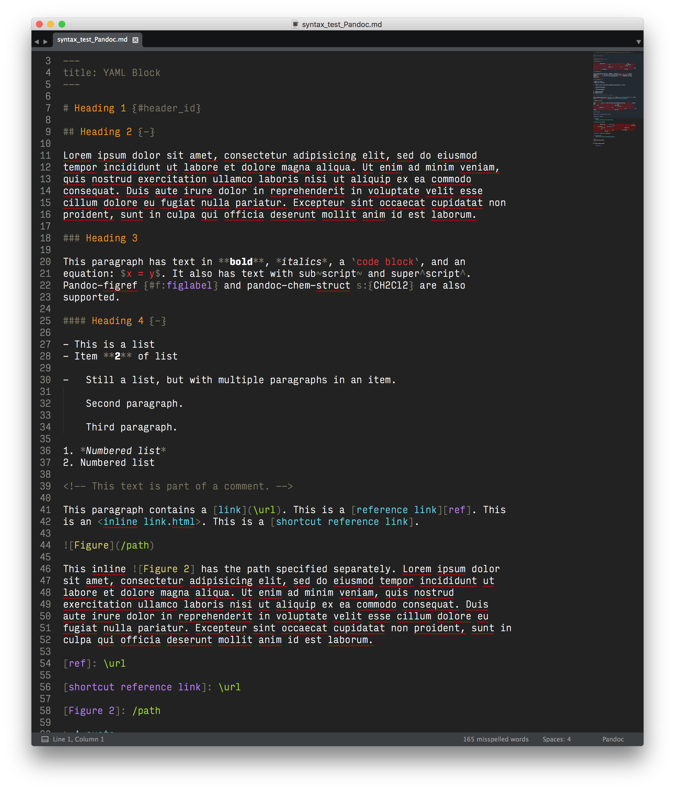

# PandocSyntax: A sublime-syntax definition for users of Pandoc

PandocSyntax is a simple syntax definition file for [Sublime Text 4][] (build
4075 or later) in the [.sublime-syntax][] format. It is designed to work with
the [Monokai Extended][] color scheme, although this should be easily
modifiable.

YAML front matter, fenced code blocks with a recognized language (`python`,
`r`, `bash`, `latex`, …), and `\begin{…}…\end{…}` LaTeX environments are
highlighted with Sublime Text's built-in syntaxes.

[Sublime Text 4]: https://www.sublimetext.com/
[.sublime-syntax]: https://www.sublimetext.com/docs/syntax.html
[Monokai Extended]: https://github.com/jonschlinkert/sublime-monokai-extended

## Installation

Copy to Sublime Text's packages folder as `Packages/PandocSyntax`.

## Tests

Open `syntax_test_Pandoc.md` in Sublime Text and run **Tools → Build With… →
Syntax Tests**.
